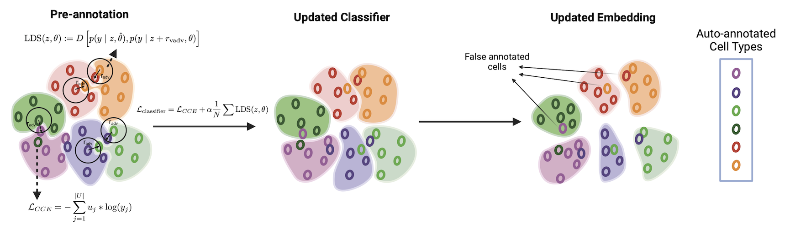

# scCRAFT+


## Installation
* Requested enviroment creation, packages including Pytorch and jax of corresponding version can be found in scVI install page: https://docs.scvi-tools.org/en/stable/installation.html
* scCRAFT can also be downloaded from GitHub:
```bash
git clone https://github.com/ch2343/scCRAFTplus.git
cd scCRAFTplus
pip install .
```

Normally the installation time is less than 5 minutes.

## Quick Start
### Scenario One: Partially or Fully annotated cells
**This scenario applies when you have partially annotated cells with high-confidence labels. For example, it is suitable when working with one or more large datasets with well-curated annotations that you wish to transfer to other batches or samples.**

Starting with raw count matrices formatted as AnnData objects, scCRAFT+ uses a standard pipline adopted by Seurat and Scanpy to preprocess data.
```python
import scCRAFTplus
from scCRAFTplus.annot import *
from scCRAFTplus.model import *

# read AnnData (all batches merged into one adata with aligned genes and metadata contains the batch indicator 'batch' for example in adata.obs)
adata = sc.read_h5ad("adata.h5ad")
adata.raw = adata
sc.pp.filter_cells(adata, min_genes=300)
sc.pp.filter_genes(adata, min_cells=5)
adata.layers["counts"] = adata.X.copy()
sc.pp.normalize_per_cell(adata, counts_per_cell_after=1e4)
sc.pp.log1p(adata)
sc.pp.highly_variable_genes(adata, n_top_genes=2000, batch_key='batch')
adata = adata[:, adata.var['highly_variable']]
```
Here, we have to create one column of labels for scCRAFT+ to learn. You can create by the following strategy (We adopt the random assign as the example, you can adjust by your own scenario for example partially annotated batches):

```python
# Initialize all labels with NaN
semi_labels = pd.Series(np.nan, index=adata.obs.index)

# Randomly select 10% of the indices without replacement
indices = np.random.choice(adata.obs.index, size=num_labeled, replace=False)

# Assign the corresponding 'celltype' labels to these selected indices
semi_labels.loc[indices] = adata.obs.loc[indices, 'CellType']

# Now 'semi_labels' contains 10% known labels and 90% NaN
adata.obs['hard_label'] = semi_labels
adata.obs['hard_label'] = adata.obs['hard_label'].astype('category')
```
This adata.obs['hard_label'] should exist before moving forward

Then scCRAFT+ performed the clustering, training and embedding obtaining.
```python
multi_resolution_cluster(adata, resolution1 = 0.5, method = 'Leiden')
VAE, C = train_integration_model(adata, batch_key = 'batch', z_dim=50, epochs = 150, d_coef = 0.2, kl_coef = 0.005, warmup_epoch = 50, hard_label = True)
obtain_embeddings_hard_label(adata, VAE, C)

#Visualization
sc.tl.umap(adata, min_dist=0.5)
sc.pl.umap(adata, color=["batch", "celltype", "Predict_label"], frameon=False, ncols=1)
```
The evaluating procedure `obtain_embeddings()` saves the integrated latent representation of cells in `adata.obsm['X_scCRAFT']` directly, which can be used for downstream integrative analysis. The adata.obs["Predict_label"] is the reliable prediction of cell types from the algorithm.

### Scenario Two: Without information of cell type labels
**This scenario is applicable when no additional cell type information is available. The algorithm can still improve integration performance, even in the absence of tissue-specific markers. In such cases, alternative marker sets, such as those for PBMCs, can be effectively utilized.**

Similarly from the anndata matrices, we perform the traditional analysis pipeline to preprocess the data.
We perform the auto-annotation based on the marker lists. We have predefine our marker list from Azimuth for users for different tissues.

We would suggest using the following marker list for the corresponding tissues: markers_pancreas, markers_lung_v2, markers_PBMC_l3, markers_heart, markers_human_cortex and markers_mouse_cortex.

Then we start the preprocessing and pre-annotation steps:
```python
adata = sc.read_h5ad("adata.h5ad")
adata.raw = adata
sc.pp.filter_cells(adata, min_genes=300)
sc.pp.filter_genes(adata, min_cells=5)
adata.layers["counts"] = adata.X.copy()
sc.pp.normalize_per_cell(adata, counts_per_cell_after=1e4)
sc.pp.log1p(adata)

#Here we use PBMC tissue as an example, so we adopt the markers_PBMC_l3 as the option.
ranks = rank_genes(adata, markers_PBMC_l3)
start_time = time.time()
process_cell_types_with_ranks(adata, markers_PBMC_l3, ranks)
perform_permutation_tests(adata, markers_PBMC_l3, ranks, threshold = 0.05, n_permutations=100, temperature=1)
# End timer
end_time = time.time()
training_time = end_time - start_time
print(f"Training completed in {training_time:.2f} seconds")
sc.pp.highly_variable_genes(adata, n_top_genes=2000, batch_key='batch')
adata = adata[:, adata.var['highly_variable']]
```
Then scCRAFT+ performed the clustering, training and embedding obtaining.
```python
multi_resolution_cluster(adata, resolution1 = 0.5, method = 'Leiden')
VAE, C = train_integration_model(adata, batch_key = 'batch', z_dim=50, epochs = 150,  d_coef = 0.2, kl_coef = 0.005, warmup_epoch = 50, hard_label = False)
obtain_embeddings(adata, VAE, C, cell_types_markers = markers_PBMC_l3, temperature=1.0, tau_e=-2)

#Visualization
sc.tl.umap(adata, min_dist=0.5)
sc.pl.umap(adata, color=["batch", "celltype", "Predict_label", "marker_label"], frameon=False, ncols=1)
```
This adata.obs['marker_label'] stores the pre-annotation purely based on the markers.


#### Parameters in `scCRAFT+ training`:
* `method`: Method of the clustering. 'Leiden' will take more time but might provide more accurate result. *Default*: `Louvain`.
* `resolution1`: Coefficient of the low resolution clustering. A higher low resolution might separate same cell type. *Default*: `0.5`.
* `epochs`: Number of steps for training. *Default*: `150`. Use `epochs=50` for datasets with batch number over 80. (Drop this manually if even more batches)
* `warmup_epoch`: Number of steps for warm-up training. *Default*: `50`. warmup_epoch should be about 1/3 of the epochs (adjust according to the epochs choice)
* `d_coef`: The coefficient of discriminator loss in the overall loss. Higher value means stronger mixing. *Default*: `0.2`.
* `kl_coef`: kl divergence proportion in the VAE loss. *Default*: `0.005`. Sometimes drop it to 0.0005 or 0.0001 to achieve better cell conservation.
* `tau_e`: Parameters that can be adjusted to make the prediction less confident. If it is lower, more cells will be annotated as unknown in Predict_label. You can keep the temperature here to be stable and adjust the tau_e if you are not satisfied with the prediction confidence.
* `threshold`: The threshold for the permutation test is also to evaluate whether you have enough confidence to pre-annotate this cells. The pre-annotated results is store in adata.obs['marker_label']
